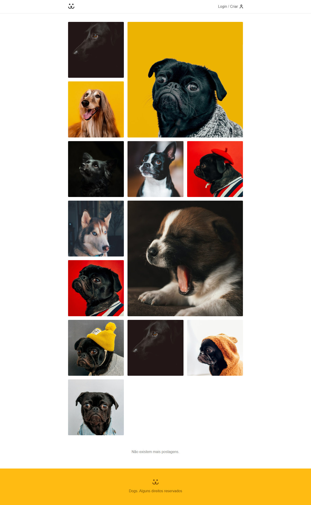

# Projeto Dogs

[Clique aqui e veja o projeto](https://dogs-andersonrodriguesdev.netlify.app/)

---
## Descrição

Dogs é uma rede social para cachorros. Este é o projeto final do curso de React da Origamid.

---
## 🚀 Tecnologias 

- [Vite](https://vitejs.dev/)
- [React](https://reactjs.org/)
- [React Router](https://reactrouter.com/en/main)
- [Victory](https://formidable.com/open-source/victory/)


---
## Como usar 

### Clone esse repositório
```bash
$ git clone https://github.com/anderson-rodriguesdev/dogs.git
```

### Instale as dependências
```bash
$ npm install
```

### Inicie o projeto com o comando:
```bash
$ npm run dev
```

# Layout
